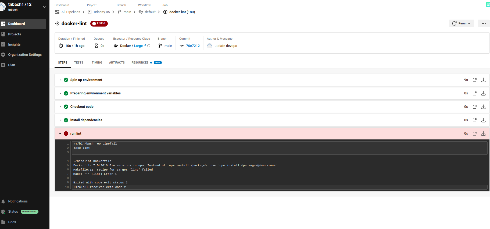
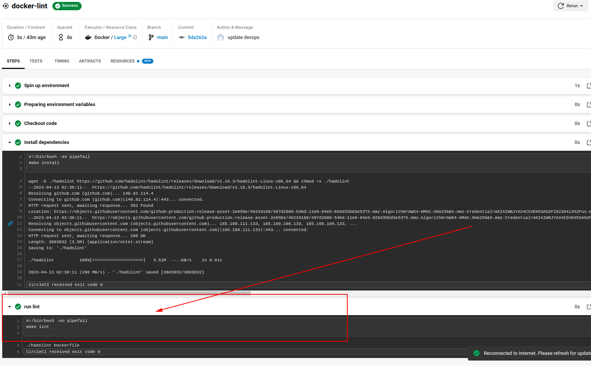
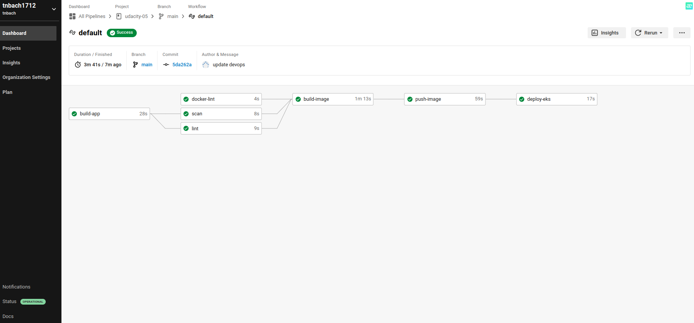
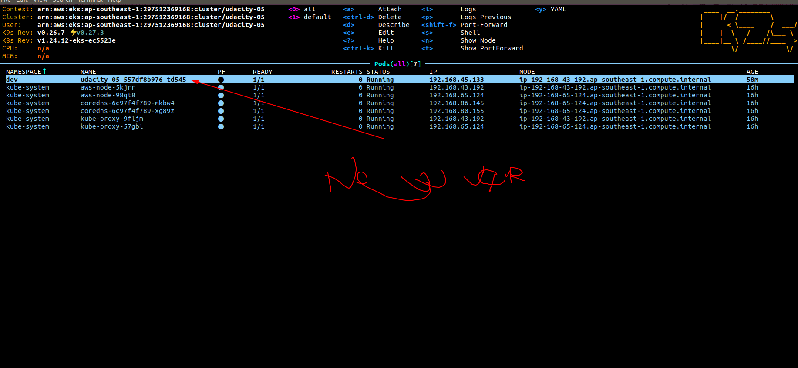
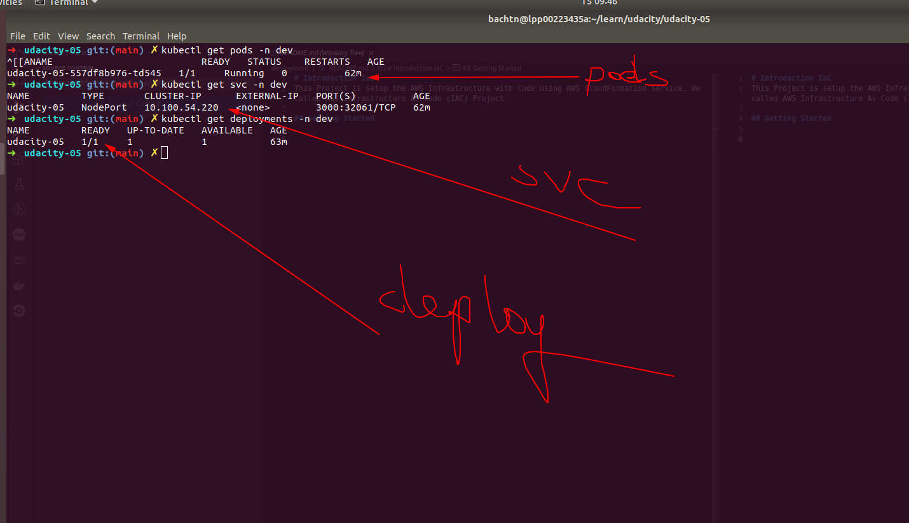
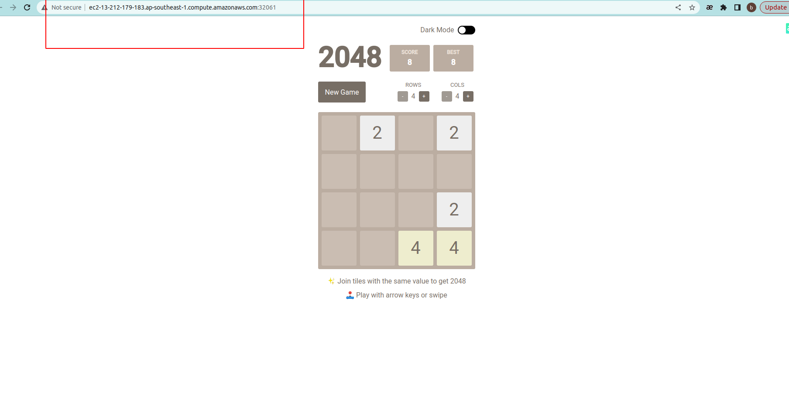

# Udacity-05

## Started
****
### Application URL: 
```
http://ec2-13-212-179-183.ap-southeast-1.compute.amazonaws.com:32061/
```
### Docker lint check

<b>Lint failed</b>:





<b>Lint success</b>:


### Docker hub

I create and push image to docker hub
```
https://hub.docker.com/repository/docker/abc1zbq/bachtn-udacity-05/general

```
### The cluster is deployed with CloudFormation or Ansible. This should be in the source code of the student’s submission.

I use cloudformation to create Cluster and nodes
You can check at ([here](devops/cloudformation/cluster.yaml))
and ([here](devops/cloudformation/node-group.yaml))

### Circle CI Pipeline:


### Screenshot of your AWS EC2 page showing the newly created (for blue/green) or modified (for rolling) instances running as the EKS cluster nodes.


### Screenshot of the kubectl command output showing that the deployment is successful, pods are running, and the service can be accessed via an external IP or port forwarding.

### Screenshot showing that you can access the application after deployment.

